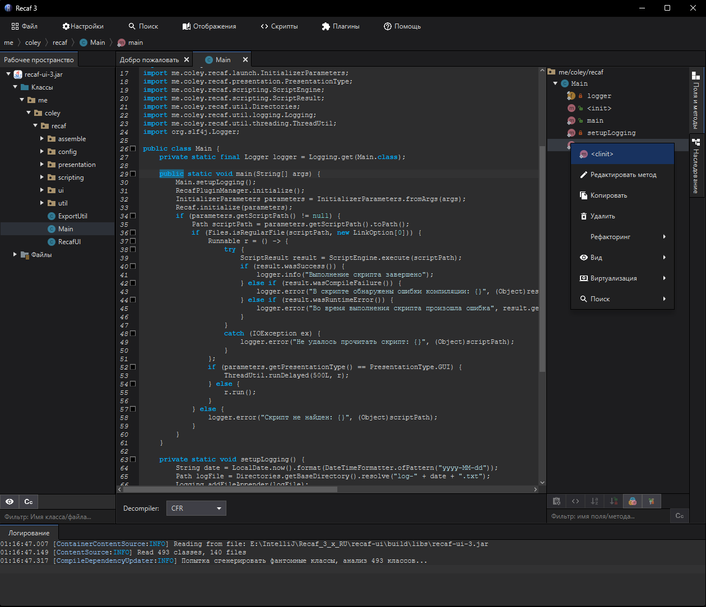

# Recaf 3.X - Dev branch [](https://discord.gg/Bya5HaA) [](CONTRIBUTING.md)



Это третья ветка редизайна. Данная программа представляет собой перевод оригинальной версии Recaf без глобальных изменений.

Оригинальный разработчик давно забросил эту версию программы.

## Использование

Для сборки выполните команду `gradlew clean shadowJar`. В результате будет создан файл  
`recaf-ui\build\libs\recaf-ru-$VERSION$-Java11-or-higher`.

Для запуска из среды разработки (IDE) используйте главный класс модуля `UI`:  
`me.coley.recaf.Main`.

Если вы не хотите компилировать вручную, можете скачать уже собранную версию отсюда:  
[Recaf-RU 3v (релизы)](https://github.com/b0b0b0b0b0b0b0b0b0b0b0b0b0b0b0b0/Recaf-RU-3v/releases)  
Просто скачайте и запустите.

# Внимание!

Для запуска нужна **Java 11 и выше**.  
**Не пытайтесь запускать программу с Java 8** – она не будет работать.

---

## Как запустить?

**Пример запуска:**

1. **Создайте файл** с расширением `.bat` (например, `start.bat`) рядом с файлом **recaf-ru-3-Java11-or-higher.jar**.
2. **Откройте файл в Блокноте** и вставьте команду:
   ```bat
   "C:\Program Files\Eclipse Adoptium\jdk-11.0.22.7-hotspot\bin\java.exe" ^
    -jar recaf-ru-3-Java11-or-higher.jar
   ```
3. **Сохраните и запустите `start.bat` двойным кликом**. 

## Разбор команды

- `"C:\Program Files\Eclipse Adoptium\jdk-11.0.22.7-hotspot\bin\java.exe"`  
  Это путь до **Java 11**.  
  Если у вас другой путь, замените его на актуальный.

- `-jar recaf-ru-3-Java11-or-higher.jar`  
  Запускает Recaf. Убедитесь, что `jar` лежит в той же папке.

Если программа **не запускается** – проверьте, установлена ли у вас **Java 11+**.

Также в `.bat` файле можно добавить `pause` в конце. Это предотвратит автоматическое закрытие консоли и позволит увидеть возможные ошибки.
Пример:
   ```bat
   "C:\Program Files\Eclipse Adoptium\jdk-11.0.22.7-hotspot\bin\java.exe" ^
    -jar recaf-ru-3-Java11-or-higher.jar
    pause
   ```
Запустите `.bat` снова и прочитайте сообщение об ошибке.
